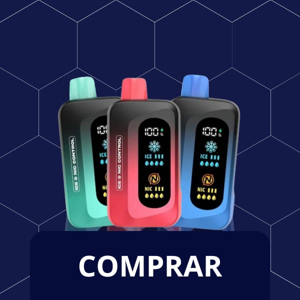
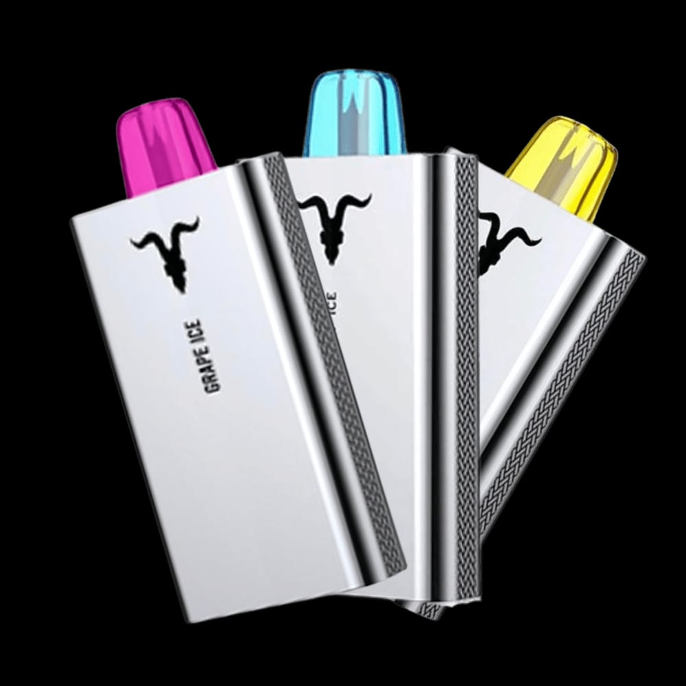
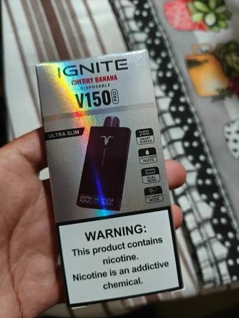
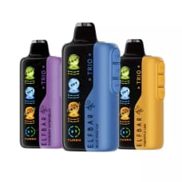
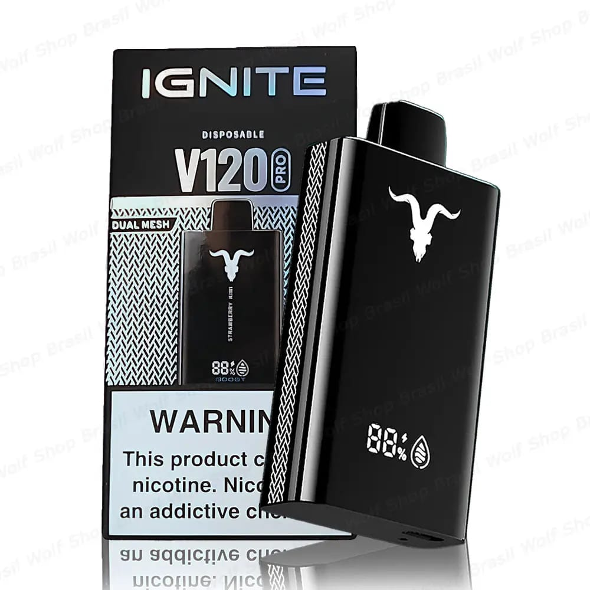

<!DOCTYPE html>
<html lang="pt-BR">
<head>
  <meta charset="UTF-8">
  <meta name="viewport" content="width=device-width, initial-scale=1.0">
  <title>SmokePods</title>

  
</head>

<body>

  <header>
    <h1>SmokePods</h1>
    

      Estilo único. Do seu jeito.
    

  </header>

  <h2 class="titulo">💜 Nossos Produtos</h2>

  

    Confira nossos modelos personalizados.
  

  <main class="produtos">

    <!-- PRODUTO 1 -->
    

      

      <h2>Pod personalizado</h2>

      

        Modelo exclusivo personalizado à mão.
      

      

        R$ 70,00
      

      <a class="botao" href="#">
        COMPRAR
      </a>
    

    <!-- PRODUTO 2 -->
    

      

      <h2>Pod personalizado</h2>

      

        Modelo exclusivo personalizado à mão.
      

      

        R$ 70,00
      

      <a class="botao" href="#">
        COMPRAR
      </a>
    

    <!-- PRODUTO 3 -->
    

      

      <h2>Pod personalizado</h2>

      

        Modelo exclusivo personalizado à mão.
      

      

        R$ 70,00
      

      <a class="botao" href="#">
        COMPRAR
      </a>
    

    <!-- PRODUTO 4 -->
    

      

      <h2>Pod personalizado</h2>

      

        Modelo exclusivo personalizado à mão.
      

      

        R$ 70,00
      

      <a class="botao" href="#">
        COMPRAR
      </a>
    

    <!-- PRODUTO 5 -->
    

      

      <h2>Pod personalizado</h2>

      

        Modelo exclusivo personalizado à mão.
      

      

        R$ 70,00
      

      <a class="botao" href="#">
        COMPRAR
      </a>
    

  </main>

  <footer>
    © 2026 SMOKEPODS — Todos os direitos reservados.
  </footer>

</body>
</html>